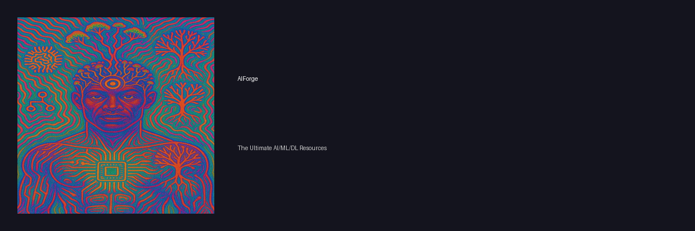

# 🎨 AIForge Logo Usage Guide

**Version / Versão:** 1.0  
**Date / Data:** November 6, 2025

---

## Logo Files / Arquivos do Logotipo

The AIForge brand includes several logo variations for different use cases:

O brand AIForge inclui várias variações do logotipo para diferentes casos de uso:

| File / Arquivo | Size / Tamanho | Use Case / Caso de Uso |
|---|---|---|
| `logo.png` | 512x512 | General purpose, square format |
| `logo-large.png` | 1024x1024 | High-resolution, print quality |
| `logo-icon.png` | 512x512 | Icon with gradient background |
| `logo-small.png` | 128x128 | GitHub avatar, small icons |
| `logo-horizontal.png` | 1200x400 | Horizontal layout with text |
| `logo-banner.png` | 1920x480 | Website banner, header |
| `docs/favicon.png` | 64x64 | Browser favicon |

---

## Logo Design / Design do Logotipo

### Concept / Conceito

**[EN]** The AIForge logo represents the fusion of traditional craftsmanship (anvil) with modern artificial intelligence (neural network nodes). The anvil symbolizes the "forge" where AI resources are crafted and curated, while the neural network nodes above represent the AI/ML/DL ecosystem.

**[PT]** O logotipo do AIForge representa a fusão da artesania tradicional (bigorna) com a inteligência artificial moderna (nós de rede neural). A bigorna simboliza a "forja" onde os recursos de IA são criados e curados, enquanto os nós de rede neural acima representam o ecossistema de IA/ML/DL.

### Color Palette / Paleta de Cores

| Color / Cor | Hex Code | RGB | Usage / Uso |
|---|---|---|---|
| Primary Blue / Azul Primário | `#667eea` | (102, 126, 234) | Main brand color, anvil base |
| Secondary Purple / Roxo Secundário | `#764ba2` | (118, 75, 162) | Gradient, anvil top |
| Accent Red / Vermelho de Destaque | `#ff6b6b` | (255, 107, 107) | Neural nodes, spark effect |
| White / Branco | `#ffffff` | (255, 255, 255) | Text on dark backgrounds |

---

## Usage Guidelines / Diretrizes de Uso

### ✅ Recommended Uses / Usos Recomendados

**[EN]**
- GitHub repository avatar
- README.md header
- Website favicon
- Social media profile pictures
- Documentation headers
- Presentation slides
- Marketing materials

**[PT]**
- Avatar do repositório no GitHub
- Cabeçalho do README.md
- Favicon do website
- Fotos de perfil em redes sociais
- Cabeçalhos de documentação
- Slides de apresentação
- Materiais de marketing

### ❌ Prohibited Uses / Usos Proibidos

**[EN]**
- Do not modify the logo colors
- Do not distort or stretch the logo
- Do not add effects (shadows, glows, etc.)
- Do not use low-resolution versions for print
- Do not place on busy backgrounds that reduce visibility

**[PT]**
- Não modifique as cores do logotipo
- Não distorça ou estique o logotipo
- Não adicione efeitos (sombras, brilhos, etc.)
- Não use versões de baixa resolução para impressão
- Não coloque em fundos ocupados que reduzam a visibilidade

---

## Specific Use Cases / Casos de Uso Específicos

### 1. GitHub Repository Avatar

**File:** `logo-small.png` (128x128)

**[EN]** Upload to GitHub repository settings:
1. Go to repository Settings
2. Scroll to "Social preview"
3. Upload `logo-small.png`

**[PT]** Fazer upload nas configurações do repositório GitHub:
1. Vá para Configurações do repositório
2. Role até "Social preview"
3. Faça upload de `logo-small.png`

---

### 2. README.md Header

**File:** `logo-horizontal.png` (1200x400)

**Markdown Code:**
```markdown
<p align="center">
  
</p>
```

---

### 3. Website Favicon

**File:** `docs/favicon.png` (64x64)

**HTML Code:**
```html
<link rel="icon" type="image/png" href="favicon.png">
```

---

### 4. Social Media

**Platforms / Plataformas:**
- **Twitter/X:** Use `logo-icon.png` (512x512)
- **LinkedIn:** Use `logo-icon.png` (512x512)
- **Facebook:** Use `logo-icon.png` (512x512)
- **Instagram:** Use `logo-icon.png` (512x512)

**Banner/Cover:**
- Use `logo-banner.png` (1920x480)

---

### 5. Documentation

**File:** `logo.png` (512x512) or `logo-horizontal.png` (1200x400)

**[EN]** Use in documentation headers, guides, and tutorials to maintain brand consistency.

**[PT]** Use em cabeçalhos de documentação, guias e tutoriais para manter a consistência da marca.

---

## Clear Space / Espaço Livre

**[EN]** Always maintain clear space around the logo equal to at least 10% of the logo's width. This ensures the logo has room to breathe and maintains visual impact.

**[PT]** Sempre mantenha espaço livre ao redor do logotipo igual a pelo menos 10% da largura do logotipo. Isso garante que o logotipo tenha espaço para respirar e mantenha o impacto visual.

---

## Background Recommendations / Recomendações de Fundo

### Light Backgrounds / Fundos Claros
- ✅ White / Branco
- ✅ Light gray / Cinza claro
- ✅ Soft pastels / Pastéis suaves

### Dark Backgrounds / Fundos Escuros
- ✅ Use `logo-icon.png` with gradient background
- ✅ Use `logo-banner.png` with built-in background
- ✅ Black / Preto
- ✅ Dark gray / Cinza escuro
- ✅ Navy blue / Azul marinho

---

## File Formats / Formatos de Arquivo

**Current / Atual:** PNG with transparency (RGBA)

**[EN]** All logos are provided in PNG format with transparent backgrounds for maximum flexibility. For print or vector needs, contact the repository maintainer.

**[PT]** Todos os logotipos são fornecidos em formato PNG com fundos transparentes para máxima flexibilidade. Para necessidades de impressão ou vetor, entre em contato com o mantenedor do repositório.

---

## Questions / Dúvidas

**[EN]** For questions about logo usage or to request additional formats, please open an issue on GitHub:
https://github.com/FELIPEACASTRO/AIForge/issues

**[PT]** Para dúvidas sobre o uso do logotipo ou para solicitar formatos adicionais, por favor abra uma issue no GitHub:
https://github.com/FELIPEACASTRO/AIForge/issues

---

**[EN]** Logo designed for AIForge - The Ultimate AI/ML/DL Resources Collection

**[PT]** Logotipo projetado para AIForge - A Coleção Definitiva de Recursos de IA/ML/DL
